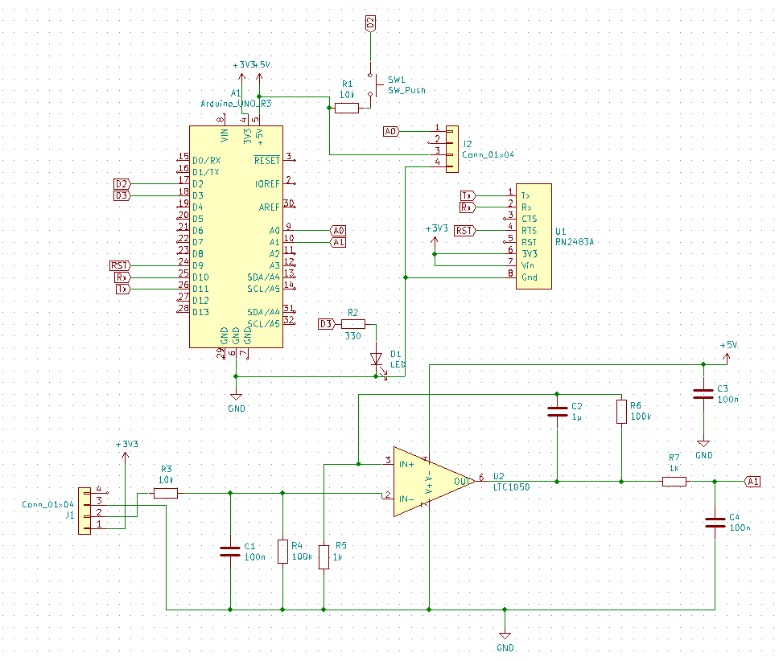
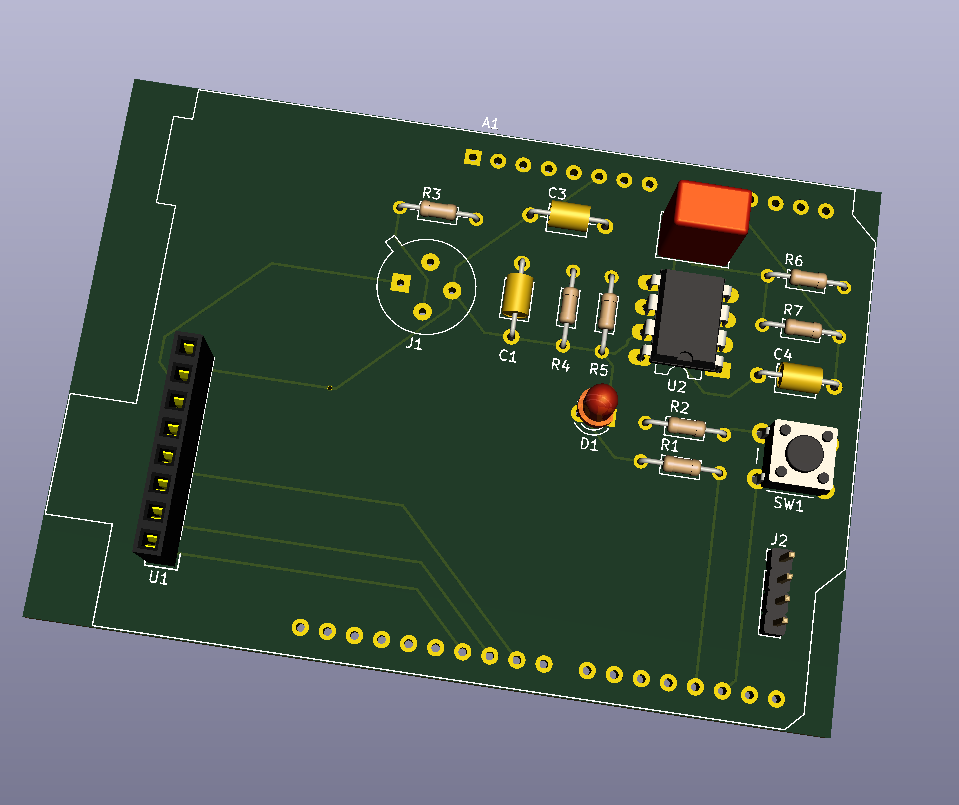
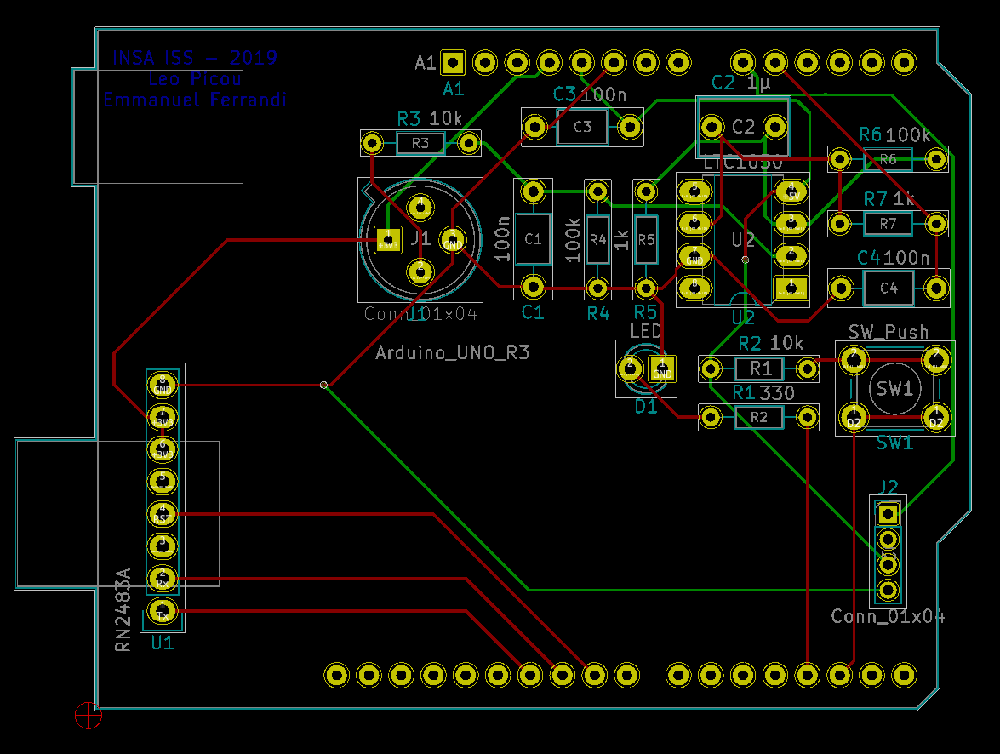

# ProjectGasSensor

Durant les différents travaux pratiques que nous avons eu, nous avons pu créer un capteur de gaz connecté. Nous avons tout d'abord réalisé un capteur de gaz depuis le début dans une salle blanche pour ensuite la connecté à une board Arduino. Dans ce repository, vous pourrez avoir accés au datasheet du capteur de gaz mais aussi le PCB conçu pour être un shield Arduino Uno.
Ainsi, on se retrouve avec un détecteur de fumée connecté à LoRa et qui a la capacité de sonné en cas de détection de fumée.

## Partie Kicad 

### Conception du traitement du signal du capteur de gaz

Nous avons utilisé un montage suggéré par Monsieur Noullet (https://noullet-gei.gitlab.io/iss_analog/) dont le but du filtre passe-bande est d'extraire toute l'information utile du capteur et atténuer la composante de bruit.
Vous pouvez voir ci-dessous le schéma électrique de ce filtrage ainsi que des autres composants utilisés sur le shield.

### Réalisation du shield Arduino Uno

Dans la partie que nous avons désiré réaliser, nous avons décidé de créer un shield avec comme composant notre capteur de gaz avec toute sa partie traîtement du signal ainsi qu'un buzzer et d'une LED. Tout ce système est relié à un programme Arduino décrit ci-dessous. Nous avons aussi souhaité rajouter un module LoRa qui permet de se connecter à l'interface IoT "The Things Network". On se retrouve ainsi avec ce shield (sous View3D de Kicad) :

On peut distinguer sur la partie haute à droite, le traitements du signal avec J1 le capteur de gaz. U1 correspond au connecteur pour le module LoRa et J2 correspond à une connectique pour le capteur de gaz de type Groove.

## Partie code 

Dans un premier temps, pour le bon fonctionnement de tous les composants, une étape de calibration est nécessaire. Pour communiquer avec le réseau The Thing Network, il faut entrer des valeurs de clé comme la devAddr (adresse de notre réseau), nwkSKey (clé pour notre réseau) et appSKey (clé de l'application de notre réseau). Pour le capteur de gaz, on doit configurer R0 afin de ...
Ensuite, viens l'étape où l'on récupére les données du capteur de gaz et on les envoie grâce à LoRa sur notre réseau. Par la suite, il est possible d'utiliser ces informations comme bon nous semble. 

## Elargissement

Pour améliorer notre projet, il est possible de faire une application Androïd qui pourrait avertir l'utilisateur de la présence du fumée au sein de sa maison. Si jamais il n'y pas de réponse de sa part, les pompiers pourraient être averti pour éviter tout risque. 
Cette architecture peut aussi être utilisé dans différents domaines comme la détection de place de parking, le détecteur de présence... Il suffit juste de changer le capteur de gaz par un autre (ainsi que modifier la partie traitement du signal).